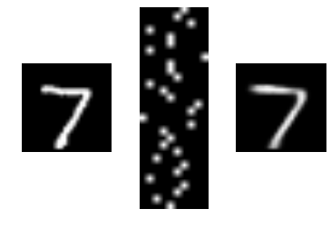
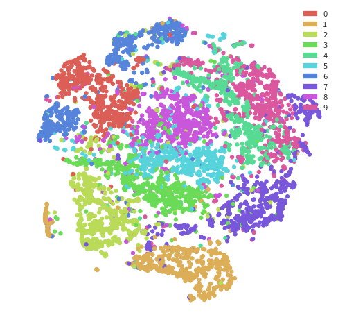

# gumbel

Gumbel-Softmax Variational Autoencoder with Keras.

This Keras based implementation of [Categorical Reparameterization with Gumbel-Softmax](https://arxiv.org/abs/1611.01144). The code is based on
[Eric Jang's tutorial](http://blog.evjang.com/2016/11/tutorial-categorical-variational.html)

You can run the Binder to get results like the following input-latent code-output triplet:     

Also, you can visualize the latent code in 2D using Hamming distance based t-SNE:    

